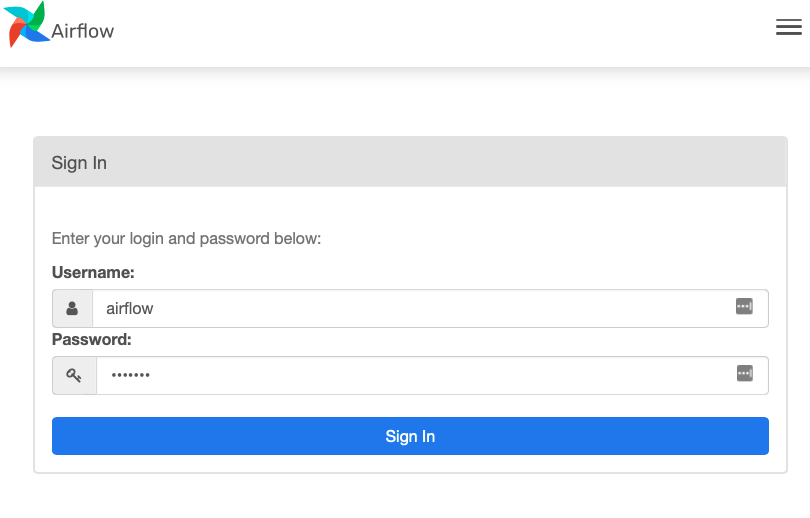
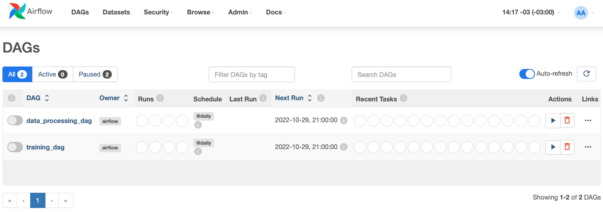
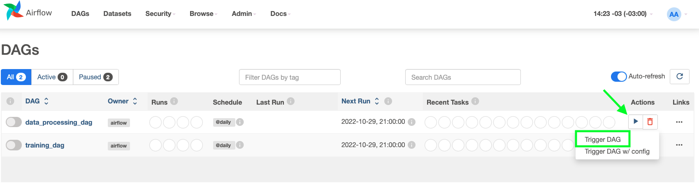
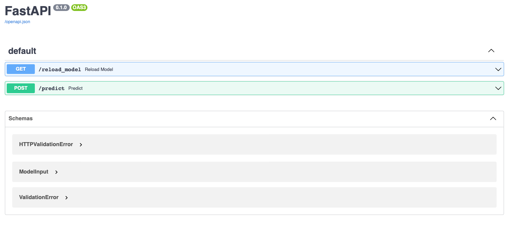

# Bain Machine Learning Engineer Challenge
## Manuel Cartagena Herrera
To solve the problem of getting this machine learning model into production, I used Airflow and FastAPI, the former to orchestrate the data preprocessing part and the training of the model in two different pipelines, where the training part culminates in a serialized model for the API to serve. The API reads this model if it exists and provides two endpoints, one to reload the model (in case the file did not exist when starting the containers) and one to make predictions using the model.

Docker and Docker-compose were used to containerize the Airflow server and the FastAPI server, the base configuration recommended by Airflow was used and an extra container was added to deploy the API.

For this challenge I assumed that the data would exist within the containers, although the extraction from the repository provided in Airflow could have been automated as a step prior to preprocessing the data. It was also assumed that the model would be trained with the same parameters used in the delivered jupyter notebook, an improvement would be to parameterize the model training plus add a way to version the models so that the API can load different models using the /reload_model endpoint. Another assumption was that the API would not make batch predictions or need authentication for this case.

### Execute the following commands only on the first run
1. `docker-compose build`
2. `docker-compose up airflow-init`
#### After the first run, only execute
3. `docker-compose up`

This will launch the Airflow server and the API for the model, if it's the first time running this containers, the model will not be loaded automatically (because the file doesn't exist yet).

### To train the model

1. Go to airflow's dashboard at [localhost:8080](http://localhost:8080) using `user: airflow` and `password: airflow`

2. Trigger the data_processing DAG
3. After that, trigger the training DAG

The model should be trained and serialized after running both DAGs.

### To use the model through its API

The API runs in [localhost:8000](http://localhost:8000) and its documentation is in [localhost:8000/docs](http://localhost:8000/docs)

1. If it's the first run of this docker-compose use the /reload_model endpoint to load the previously trained model through Airflow, if the serialized model already exists, it should be loaded when the API starts. If the model is succesfully loaded, you should receive a response 200 saying `Model loaded`.
2. After the model is successfully loaded, the model works in the /predict endpoint. There's an example json body in the examples folder. If you try to use this endpoint without a model loaded it should respond with a status code 503 that says `Model not loaded` 
